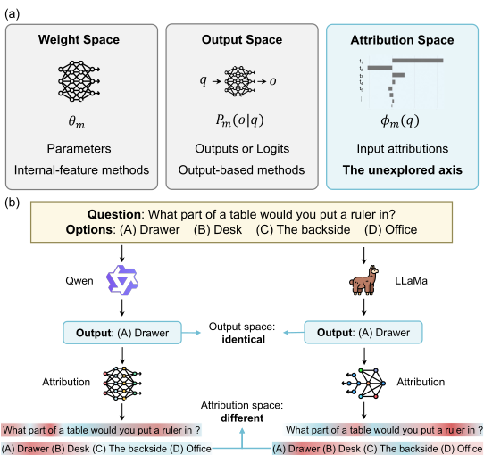
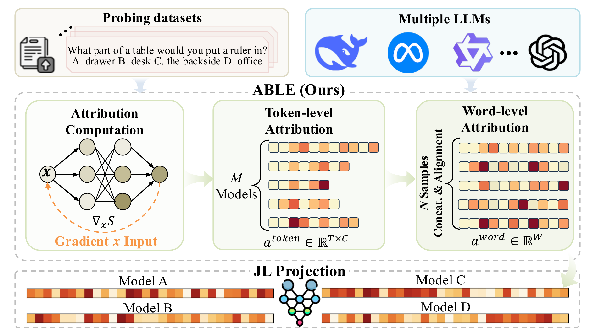

# ABLE: Representing and Mapping LLMs via Attribution-Based Large-model Embedding

<p align="center">
  English | <a href="README_zh-CN.md">简体中文</a>
</p>

<p align="center">
  <a href="https://ziiroo1126.github.io/ABLE/">🕸️ Project Page</a> |
  <a href="https://arxiv.org/abs/2606.07524">📝 Paper</a> |
  <a href="LICENSE">Apache-2.0 License</a>
</p>

ABLE (**A**ttribution-**B**ased **L**arge-model **E**mbedding) is a
training-free framework for representing language models in *attribution
space*. Instead of characterizing a model only by its parameters or final
outputs, ABLE summarizes how the model depends on shared input evidence over a
fixed probing corpus.

Given multiple-choice probes, ABLE computes option-aware feature attributions,
aligns tokenizer-dependent scores into a shared word–option coordinate system,
and applies random projection to produce a compact model embedding. The
embedding is computed once per model and can be reused in different downstream
analyses.

<p align="center">
  
</p>

ABLE is designed around three properties:

- **Model-level input-dependence signatures:** attribution scores expose which
  parts of a shared input support each answer option. Models that return the
  same answer may therefore still have different ABLE representations.
- **Cross-tokenizer comparability:** token scores are first distributed over
  their character spans and then aggregated by word, placing heterogeneous
  tokenizers in the same word–option coordinate system.
- **Training-free, reusable embeddings:** ABLE construction does not learn or
  update model parameters. Its default Gradient × Input extraction uses
  a forward--backward pass, after which the resulting embedding can be reused;
  task-specific predictors in the paper are trained separately.

## 🔧 How to calculate ABLE features

ABLE contains three main steps:

1. **Option-aware attribution computation:** compute Gradient × Input
   scores for every question token with respect to each answer option's
   sequence log-probability. Gold labels are not used for attribution
   extraction.
2. **Cross-tokenizer alignment:** distribute token attribution over character
   spans, aggregate characters into whitespace-delimited words, and preserve
   separate attribution channels for all answer options.
3. **Compact embedding construction:** concatenate the aligned attribution
   patterns and apply Johnson--Lindenstrauss random projection to obtain the
   final low-dimensional ABLE embedding.

<p align="center">
  
</p>

### 📦 Installation

```bash
git clone https://github.com/ziiroo1126/ABLE.git
cd ABLE
python -m pip install -e .
```

ABLE currently supports repository-based use only. Run the commands from the
root of a cloned checkout and keep the repository resources in place.
`python -m pip install .` is not supported, and neither is installation from a
built wheel, because the model lists and probing data intentionally remain
repository resources rather than package data.

The editable installation installs the dependencies recorded in
`requirements.txt` and provides the `able-calculate`, `able-convert`, and
`able-project` commands. The original `python -m src.<module>` forms remain
available. If your CUDA installation requires a platform-specific PyTorch
wheel, install the matching PyTorch build first and then run the command above.
Editable installation requires pip 21.3 or newer; upgrade pip first if an older
environment reports that editable `pyproject.toml` installs are unsupported.

### 📚 Probe Data and GPQA Access

The repository includes `ABLE_dataset_public_1000.jsonl`, containing 200
examples each from ARC, HellaSwag, MMLU, WinoGrande, and CommonsenseQA. The
paper's full 1,200-example corpus additionally contains 200 GPQA examples.
Because the official GPQA access conditions ask users not to reveal examples
online, GPQA question and answer text is not redistributed in this repository.

For exact paper reproduction, first accept access on the
[official GPQA dataset page](https://huggingface.co/datasets/Idavidrein/gpqa),
authenticate with `hf auth login`, and run:

```bash
python scripts/build_full_probe_dataset.py
```

This creates a local, git-ignored `ABLE_dataset_1200.jsonl` and verifies that it
matches the corpus used in the paper. See
[`data/selected_data/README.md`](data/selected_data/README.md) for source,
license, and reconstruction details.

### 🚀 Quick Start

The following smoke test uses five probing samples and the tiny public
`sshleifer/tiny-gpt2` checkpoint. Models are downloaded from the Hugging Face
Hub when they are not already cached. Set `HF_TOKEN` or run `hf auth login` for
gated models. Use `--local-files-only` only when all required files are already
in the local cache.

#### 1️⃣ Compute Token-Level ABLE Features

```bash
CUDA_VISIBLE_DEVICES=0 able-calculate example_models \
    --dataset-name ABLE_dataset_public_1000 \
    --max-samples 5 \
    --dtype float32 \
    --cache-dir ./models \
    --log-name smoke-test.log
```

#### 2️⃣ Convert Token-Level to Word-Level Attributions

```bash
able-convert \
    --input-dir ./able/ABLE_dataset_public_1000 \
    --dataset-path ./data/selected_data/ABLE_dataset_public_1000.jsonl \
    --output-dir ./able/word_level \
    --cache-dir ./models
```

Using the same `--cache-dir` in Steps 1 and 2 keeps model and tokenizer files
together. Omit the option in both steps to use the standard Hugging Face cache;
add `--local-files-only` when the selected cache is already complete and network
access should be disabled.

#### 3️⃣ Apply Dimensionality Reduction

```bash
able-project \
    --method jl \
    --dim 256 \
    --input-dir ./able/word_level \
    --output-dir ./able/able_word_all_options_jl_256_norm
```

The final embedding is written below the selected output directory as one JSON
file per model. To run the paper configuration, first reconstruct the authorized
1,200-example corpus, use `model_list` instead of `example_models`, remove
`--max-samples`, select the desired dtype, and enable `--trust-remote-code` only
for repositories that require it.

### 🗂️ Data Formats

#### Probing Dataset (JSONL)

```json
{"index": 0, "full_index": 0, "resource": "ai2_arc", "question": "Question text", "choices": ["A", "B", "C", "D"], "ans_idx": 0}
```

#### Model List (YAML)

```yaml
- meta-llama/Llama-2-7b-hf
- mistralai/Mistral-7B-v0.1
- google/gemma-7b
```

#### Output

| Stage | Location | Format |
|-------|----------|--------|
| Token-level ABLE | `able/<dataset>/` | JSONL per model |
| Word-level attribution | `able/word_level/` | JSONL per model |
| Processed features | `able/able_word_jl_*/` | JSON per model |

### ⚙️ Configuration

Edit `config/_config.py` to customize:

- `ROOT_DIR`: Project root directory
- `MODELS_DIR`: Model list directory
- `TEXT_DATA_DIR`: Input data directory
- `ABLE_DATA_DIR`: Output directory

### ✅ Tests

The default test suite is self-contained and does not download models or
require a GPU:

```bash
python -m unittest discover -s tests -v
```

It covers UTF-8 dataset loading, CLI defaults and failure propagation,
token-to-word attribution conservation, directory-level attribution
conversion, multi-model feature projection, correct-option selection, invalid
feature inputs, and idempotent result resumption.

## 🏗️ Project Structure

```bash
ABLE/
├── LICENSE                     # Apache-2.0 license
├── pyproject.toml              # Package metadata and command-line entry points
├── requirements.txt            # Reference Python dependencies
├── config/                     # Configuration module
│   └── _config.py             # Path and directory configurations
├── data/
│   ├── models/                 # Model metadata
│   │   ├── example_models.yaml # Small smoke-test model list
│   │   ├── model_list.yaml    # Paper model list
│   │   └── model-family.csv   # Model family mappings
│   └── selected_data/          # Input text data
│       ├── ABLE_dataset_public_1000.jsonl
│       ├── gpqa_selection_manifest.json
│       └── README.md            # Authorized full-corpus reconstruction
├── scripts/
│   └── build_full_probe_dataset.py
├── src/                        # Core source code
│   ├── calculate_able.py      # Main entry point
│   ├── runner.py              # ABLE computation runner
│   ├── token_to_word_attribution.py   # Token to word converter
│   ├── process_able_features.py       # Feature post-processing
│   ├── calculator/            # Core ABLE calculation
│   ├── io/                    # Data I/O utilities
│   └── logging/               # Logging utilities
├── tests/                      # Network- and GPU-independent test suite
├── able/                       # Output directory (auto-created)
└── log/                        # Log directory (auto-created)
```

## 📝 Citation

If you use ABLE, please cite:

```bibtex
@article{wang2026able,
  title={ABLE: Representing and Mapping LLMs via Attribution-Based Large-model Embedding},
  author={Wang, Zirui and Hou, Yusen and Liang, Shaofeng and Tian, Bowen and Zhang, Yanlin and Chen, Wenshuo and Yue, Yutao},
  journal={arXiv preprint arXiv:2606.07524},
  year={2026}
}
```

## 📄 License

The source code in this repository is released under the
[Apache License 2.0](LICENSE). The probing examples remain subject to the
source-dataset licenses documented in
[`data/selected_data/README.md`](data/selected_data/README.md).
