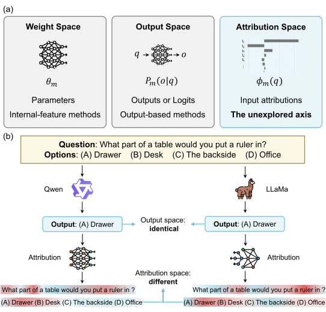
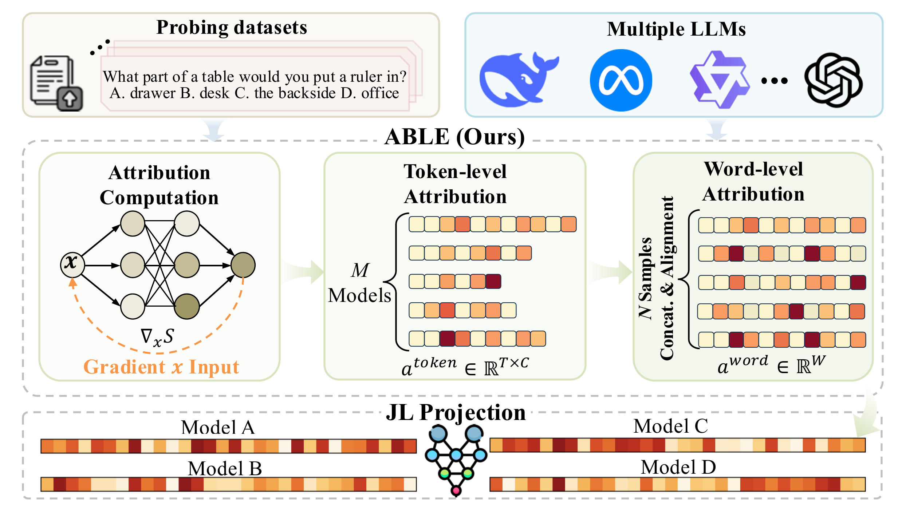

# ABLE：基于归因的大模型嵌入表示与映射

<p align="center">
  <a href="README.md">English</a> | 简体中文
</p>

<p align="center">
  <a href="https://ziiroo1126.github.io/ABLE/">项目主页</a> |
  <a href="https://arxiv.org/abs/2606.07524">论文</a> |
  <a href="LICENSE">Apache-2.0 许可证</a>
</p>

<p align="center"><strong>EMNLP 2026 Oral</strong></p>

ABLE（**A**ttribution-**B**ased **L**arge-model **E**mbedding，基于归因的大模型嵌入）是一种在*归因空间*中表示语言模型的免训练框架。与仅通过参数或最终输出来刻画模型不同，ABLE 汇总模型在固定探测语料上如何依赖共享输入证据。

给定多项选择探测样本，ABLE 计算面向各候选选项的特征归因，将依赖 tokenizer 的归因分数对齐到共享的“词–选项”坐标系，再通过随机投影生成紧凑的模型嵌入。每个模型只需计算一次嵌入，之后即可复用于不同的下游分析。

<p align="center">
  
</p>

ABLE 的设计具有以下三个特点：

- **模型级输入依赖特征**：归因分数反映共享输入的不同部分如何支持各候选选项。因此，即使两个模型给出相同答案，其 ABLE 表示也可能不同。
- **跨 tokenizer 可比性**：先将 token 归因均匀分配到对应字符区间，再聚合到词级，使采用不同 tokenizer 的模型进入同一个“词–选项”坐标系。
- **免训练且可复用的嵌入**：构建 ABLE 不需要学习或更新模型参数。默认的 Gradient × Input 提取需要进行前向与反向传播，但得到的嵌入可以重复使用；论文中的任务特定预测器则单独训练。

## 🔧 计算 ABLE 特征

ABLE 的计算包含三个主要步骤：

1. **面向候选选项的归因计算**：针对每个候选答案的序列对数概率，计算各问题 token 的 Gradient × Input 分数；归因提取过程不使用正确答案标签。
2. **跨 tokenizer 对齐**：将 token 归因分配到字符区间，再按空白符切分并聚合到词级，同时保留所有候选答案各自的归因通道。
3. **紧凑嵌入构建**：拼接对齐后的归因模式，并通过 Johnson--Lindenstrauss 随机投影生成最终的低维 ABLE 嵌入。

<p align="center">
  
</p>

### 📦 安装

```bash
git clone https://github.com/ziiroo1126/ABLE.git
cd ABLE
python -m pip install -e .
```

ABLE 目前仅支持基于克隆仓库的使用方式。请始终在仓库根目录运行命令，并保持仓库中的模型清单和探测数据位于原始位置。不支持 `python -m pip install .`，也不支持从构建好的 wheel 安装，因为这些资源有意作为仓库数据保留，而不会被打包进 Python 安装包。

该可编辑安装会安装 `requirements.txt` 中记录的依赖，并提供 `able-calculate`、`able-convert` 和 `able-project` 三个命令。原有的 `python -m src.<module>` 形式仍然可用。如果当前 CUDA 环境需要特定的 PyTorch 轮子，请先安装与平台匹配的 PyTorch，再运行上述安装命令。

可编辑安装要求 pip 21.3 或更高版本；如果旧环境提示不支持基于 `pyproject.toml` 的可编辑安装，请先升级 pip。

### 📚 探测数据与 GPQA 访问

仓库公开提供 `ABLE_dataset_public_1000.jsonl`，其中包含 ARC、HellaSwag、MMLU、WinoGrande 和 CommonsenseQA 各 200 个样本。论文使用的完整 1,200 样本语料还包括 200 个 GPQA 样本。

GPQA 官方访问条款要求用户不要在网上公开数据样例，因此本仓库不会分发 GPQA 的题目、选项和答案文本。

如需精确复现论文实验，请先在 [GPQA 官方数据页面](https://huggingface.co/datasets/Idavidrein/gpqa)接受访问条款，然后使用 `hf auth login` 完成本地认证并运行：

```bash
python scripts/build_full_probe_dataset.py
```

脚本将在本地生成 `ABLE_dataset_1200.jsonl`，并通过规范化 SHA-256 校验其是否与论文使用的语料一致。数据来源、许可证和重建细节参见 [`data/selected_data/README.md`](data/selected_data/README.md)。

### 🚀 快速开始

以下冒烟测试使用 5 条探测样本和微型公开检查点 `sshleifer/tiny-gpt2`。本地缓存中不存在模型时，程序会从 Hugging Face Hub 下载。如需使用受限模型，请设置 `HF_TOKEN` 或先运行 `hf auth login`。仅在所需文件已完整缓存时使用 `--local-files-only`。

#### 1️⃣ 计算词元级 ABLE 归因

```bash
CUDA_VISIBLE_DEVICES=0 able-calculate example_models \
    --dataset-name ABLE_dataset_public_1000 \
    --max-samples 5 \
    --dtype float32 \
    --cache-dir ./models \
    --log-name smoke-test.log
```

#### 2️⃣ 将词元级归因转换为词级归因

```bash
able-convert \
    --input-dir ./able/ABLE_dataset_public_1000 \
    --dataset-path ./data/selected_data/ABLE_dataset_public_1000.jsonl \
    --output-dir ./able/word_level \
    --cache-dir ./models
```

在前两个步骤中使用相同的 `--cache-dir`，可以把模型权重和 tokenizer 文件集中存放。若希望使用 Hugging Face 默认缓存，请在两个步骤中都省略该参数；当指定缓存已经完整且需要禁止网络访问时，可再添加 `--local-files-only`。

#### 3️⃣ 降维

```bash
able-project \
    --method jl \
    --dim 256 \
    --input-dir ./able/word_level \
    --output-dir ./able/able_word_all_options_jl_256_norm
```

最终嵌入会以每个模型一个 JSON 文件的形式写入指定输出目录。

### 使用论文的完整 1,200 条探测语料

完成上文的授权语料重建后，归因计算和词级转换都需要使用完整数据集。以下命令处理论文模型清单中的所有模型和全部样本，并使用独立于冒烟测试的输出目录：

```bash
CUDA_VISIBLE_DEVICES=0 able-calculate model_list \
    --dataset-name ABLE_dataset_1200 \
    --dtype bfloat16 \
    --cache-dir ./models \
    --log-name paper-1200.log

able-convert \
    --input-dir ./able/ABLE_dataset_1200 \
    --dataset-path ./data/selected_data/ABLE_dataset_1200.jsonl \
    --output-dir ./able/word_level_1200 \
    --cache-dir ./models

able-project \
    --method jl \
    --dim 256 \
    --norm-mode pre \
    --input-dir ./able/word_level_1200 \
    --output-dir ./able/able_word_1200_all_options_jl_256_prenorm
```

上述命令采用论文描述的投影前 L2 归一化变体。请根据硬件和模型选择受支持的 dtype，并仅对确实需要自定义建模代码的模型仓库启用 `--trust-remote-code`。安装依赖中包含 PEFT，可加载 `model_list` 中仅提供 LoRA 适配器权重的检查点；对应基础模型也需要能够访问或已缓存。

### 升级已有结果

词元归因续算会检查聊天模板模式和 `attribution_version`（当前为 `2`）。旧版本或配置不兼容的记录会重新计算，成功后替换原记录；计算失败时保留旧文件。兼容记录仍可增量续算。如需保留多种实验配置，请分别使用独立的数据集／输出目录。

词级转换现在默认重新生成已有输出，旧的 `--no-skip-existing` 参数仍可使用。旧版聊天模板归因必须先重新计算为版本 `2`；如果源词元归因启用了 `--apply-chat-template`，转换时也应启用该参数。

每个投影输入目录中，同一模型只能包含一种 dtype。若存在同模型多 dtype 文件，程序会在写入结果前报错，请按 dtype 分开输入和输出目录。对于 JL，`--norm-mode pre` 仅在投影前进行 L2 归一化，`post` 仅在投影后进行，`both` 在前后都进行。默认值仍为 `post`；自动输出目录分别使用 `_prenorm`、`_norm`、`_bothnorm` 后缀。如需修正后的 `pre` 或 `both` 行为，请重新运行投影。

### 🗂️ 数据格式

#### 探测数据集（JSONL）

```json
{"index": 0, "full_index": 0, "resource": "ai2_arc", "question": "Question text", "choices": ["A", "B", "C", "D"], "ans_idx": 0}
```

#### 模型列表（YAML）

```yaml
- meta-llama/Llama-2-7b-hf
- mistralai/Mistral-7B-v0.1
- google/gemma-7b
```

#### 输出

| 阶段 | 位置 | 格式 |
|---|---|---|
| 词元级 ABLE | `able/<dataset>/` | 每个模型一个 JSONL 文件 |
| 词级归因 | `able/word_level/` | 每个模型一个 JSONL 文件 |
| 处理后的特征 | `able/able_word_jl_*/` | 每个模型一个 JSON 文件 |

### ⚙️ 配置

可以在 `config/_config.py` 中修改以下配置：

- `ROOT_DIR`：项目根目录
- `MODELS_DIR`：模型列表目录
- `TEXT_DATA_DIR`：输入数据目录
- `ABLE_DATA_DIR`：ABLE 输出目录

### ✅ 测试

默认测试套件无需下载模型，也不依赖 GPU：

```bash
python -m unittest discover -s tests -v
```

测试覆盖 UTF-8 数据读取、命令行默认参数与失败状态传播、词元到词级归因守恒、目录级归因转换、多模型特征投影、正确选项筛选、异常特征输入，以及可幂等恢复的结果续算。

## 🏗️ 项目结构

```text
ABLE/
├── LICENSE                     # Apache-2.0 许可证
├── pyproject.toml              # 项目元数据与命令行入口
├── requirements.txt            # 参考 Python 依赖
├── config/                     # 配置模块
│   └── _config.py             # 路径和目录配置
├── data/
│   ├── models/                 # 模型元数据
│   │   ├── example_models.yaml # 小型冒烟测试模型列表
│   │   ├── model_list.yaml    # 论文模型列表
│   │   └── model-family.csv   # 模型家族映射
│   └── selected_data/          # 输入探测数据
│       ├── ABLE_dataset_public_1000.jsonl
│       ├── gpqa_selection_manifest.json
│       └── README.md            # 完整语料授权重建说明
├── scripts/
│   └── build_full_probe_dataset.py
├── src/                        # 核心代码
│   ├── calculate_able.py      # ABLE 计算入口
│   ├── runner.py              # ABLE 计算运行器
│   ├── token_to_word_attribution.py   # 词元到词的归因转换
│   ├── process_able_features.py       # 特征后处理
│   ├── calculator/            # ABLE 核心计算
│   ├── io/                    # 数据输入输出工具
│   └── logging/               # 日志工具
├── tests/                      # 无需网络和 GPU 的测试套件
├── able/                       # 输出目录（自动创建）
└── log/                        # 日志目录（自动创建）
```

## 📝 引用

如果你在研究中使用 ABLE，请引用：

```bibtex
@article{wang2026able,
  title={ABLE: Representing and Mapping LLMs via Attribution-Based Large-model Embedding},
  author={Wang, Zirui and Hou, Yusen and Liang, Shaofeng and Tian, Bowen and Zhang, Yanlin and Chen, Wenshuo and Yue, Yutao},
  journal={arXiv preprint arXiv:2606.07524},
  year={2026}
}
```

## 📄 许可证

本仓库源代码使用 [Apache License 2.0](LICENSE) 许可证发布。探测样本仍受各原始数据集许可证约束，详见 [`data/selected_data/README.md`](data/selected_data/README.md)。
